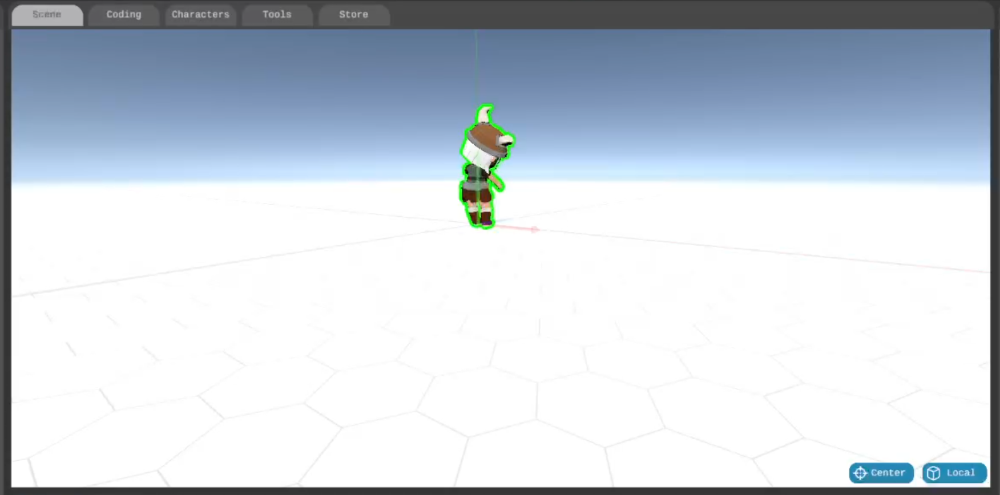
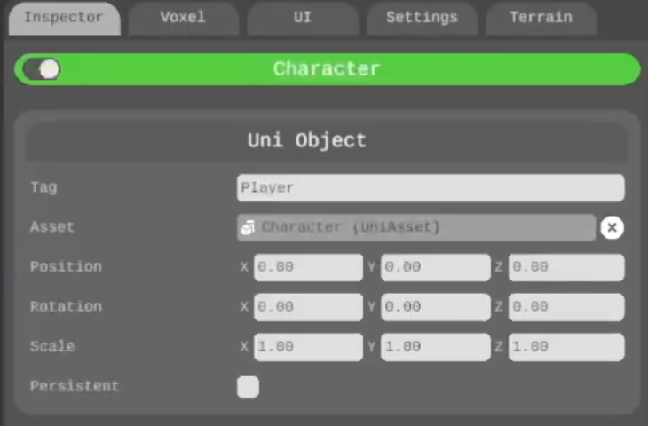

# The Scene component

The Scene component is a visual reprentation of your hierarchy, a window to your game where you modify and re-arrange your objects.

In order to move, rotate or resize your objects, either select them in your Hierarchy component or simply click on them in the Scene component, and click and drag the handles that appear on your object. Alternatively you can modify the position, rotation and scale values within the Inspector component when your object is selected.

