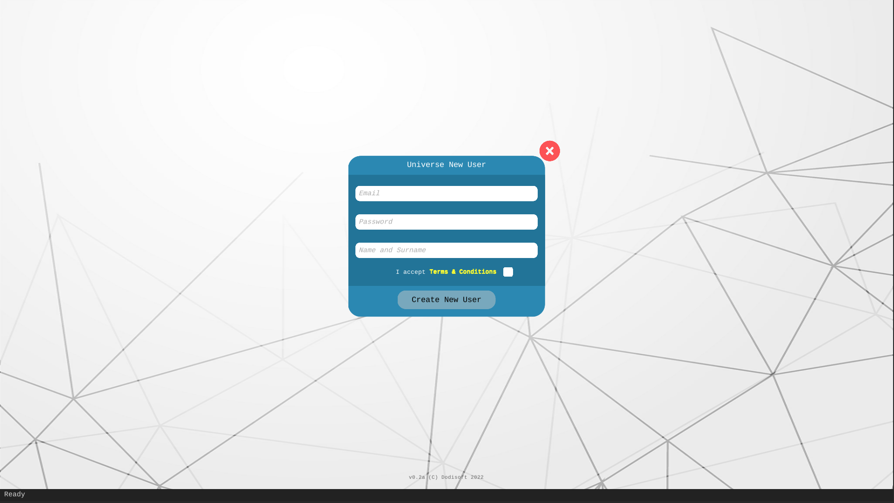
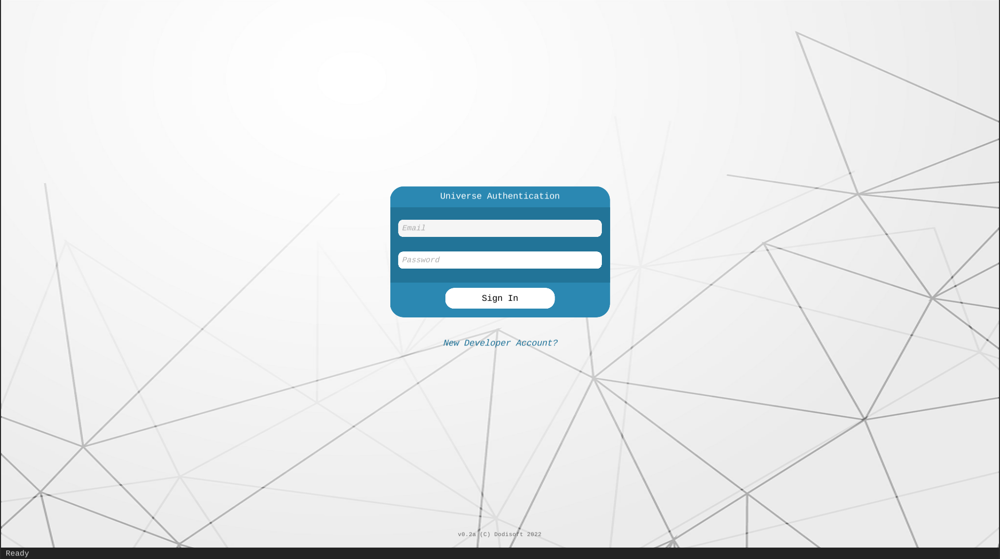
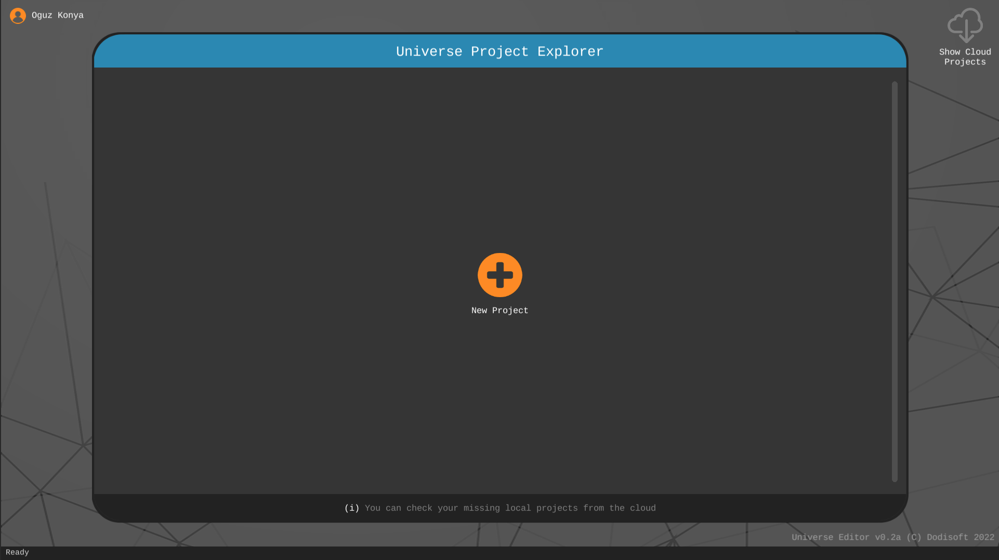
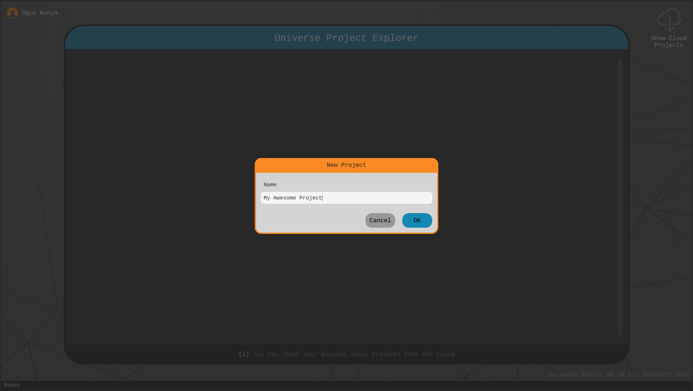
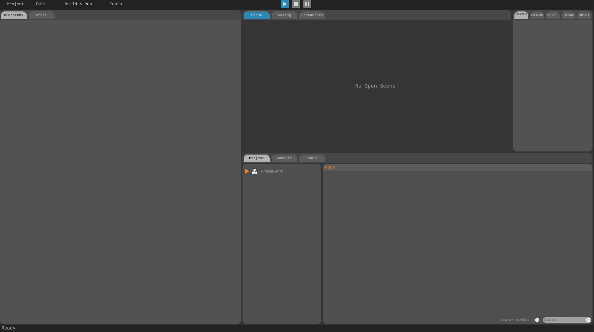

# Uni-verse Interface

Once you've installed Uni-verse Studio, simply double-click the shortcut on your desktop to kickstart your game creation journey. The create user screen will welcome you. 

Enter your details to set up your developer account. After successfully creating your account, use your login details to sign in.

The Uni-verse Project Explorer will then be visible. 
 
 

Click on the plus icon to initiate your first project. Provide a name for your project and click OK.

Your project will be created and you will be taken to the editor screen which starts up with 5 windows by default.

1. [The Toolbar](./toolbar.md) has controls for building and playing your game.

2. [The Hierarchy component](./hierarchy.md) is a hierarchical representation of your Scene. 

3. [The Scene component](./scene.md) is the window where you construct your game visually in 3D. 

4. [The Inspector component](./inspector.md) displays the properties of your objects in your scenes. It also lets you modify them to your liking.

5. [The Project component](./project.md) lists all the assets that are available to you. Think of this as your library. You can import more assets to your project either by importing them manually or visiting the [Uni-verse Asset Store](./asset-store.md).

Other than these 5 main components, there are inactive components which you can access by clicking the relevant tabs.

1. [The Store component](./asset-store.md) lets you buy and import assets from Uni-verse Asset Store. Uni-verse developers have created numerous free assets that you are welcome to use in your games without any cost.

2. [The Coding component](./coding.md) is where you create and edit your scripts.

3. [The Characters component](./characters.md) has two simple functionalities: upload your characters or create new ones.

4. [The Console component](./console.md) shows errors, warnings and messages generated by Uni-verse Studio.

5. [The Tools component](./tools.md) provides the tools to maintain your project such as backup, upload assets, check dependencies and an export wizard.

6. [The Settings component](./settings.md)

7. [The Voxel component](./voxel.md)

8. [The Terrain component](./terrain.md)

9. [The UniUI component](./uniui.md) is where the magic unfolds. This is your space to craft captivating user interfaces, allowing your players to seamlessly interact with your game.
